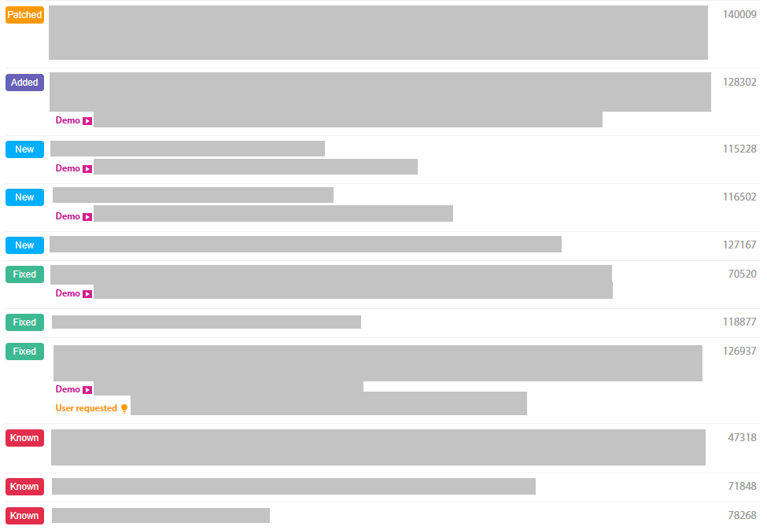

This solution automatically generates release notes from work items returned by one or more VSTS queries and publishes them as CSV, JSON, or HTML files.

> #### *Difference between this solution and the [vsts-to-release-notes-html-table](https://github.com/HealthCatalyst/vsts-release-notes-html-table) Health Catalyst project*
> *This solution generates release notes from VSTS queries. The other solution generates them from work items associated with a VSTS release.*

# Create custom VSTS work item fields if necessary
See [this info about custom work item fields in the Health Catalyst VSTS instance](https://github.com/HealthCatalyst/vsts-release-notes-html-table#step-1-identify-default-and-custom-fields-in-vsts-work-item-forms-create-custom-fields-if-necessary) for details.

# Create VSTS queries


# Modify the code
## Add your PAT
In the two lines with authorization code, enter your `username:PAT`.

[Documentation on how to get your VSTS personal access token (PAT)](https://www.visualstudio.com/en-us/docs/setup-admin/team-services/use-personal-access-tokens-to-authenticate)

Use encoding from Fiddler (to `Base64`; 2 places).

## Add your custom fields
Add references to your custom fields in:
- The `public class Fields` section at the top
- A few lines down on the `string wiDetails` line
- A few lines down on the `csv.Append` line
- A few lines down in the block of `output.Append` and `csv.Append` lines

## Add your query URLs
Replace/add one or more query URLs under `public class CodeEvaler`.

To find the URLs, modify this URL and enter it in your browser or (for better readability) a tool like Postman:
```
https://healthcatalyst.visualstudio.com/DefaultCollection/<your project name - e.g., CAP/_apis/wit/queries/shared%20queries/<directory if it exists>/<subdirectory if it exists>/<name of query - e.g., myquery>?$depth=2&api-version=2.2
```

# To automate publication with a VSTS build or release
Add VSTS build or release steps that:
- Build and execute the solution
- Run the script that outputs the notes in a format of your choice ([this script](run.ps1) includes commands)
- Publish the artifact on the server

### What the `output/start.txt` is for
For the script to output successfully, an `output` directory is required inside the parent directory. An empty directory cannot be stored in Git. `start.txt` is a blank file to allow the `output` directory to be cloned.

# To build locally
Open the solution in Visual Studio and click **Start**. For future reference if needed, this creates an **.exe** in `LeadAndCycle/bin/default`.

# Customize output
The solution exports JSON (designated by fields named in the `output.Append` lines) and CSV (designated by the fields named in the `csv.append` lines).

### HTML
Following is an example of how to modify `csv.Append` to form HTML: 

```
csv.Append("<tr style=\"font-size: 14px;\"><td align=\"left\" style=\"padding: 6px 10px 6px 0px; border-bottom: 1px solid #f0f0f0;\"><span style=\"color: white; background-color: #6761b7; text-align: center; display:block; width: 45px; padding: 1px 2px 1px 2px; border-radius: 4px; font-family: sans-serif; font-size: 85%;\">Added</span></td><td style=\"padding: 6px 10px 6px 5px; border-bottom: 1px solid #f0f0f0;\">");
csv.Append(value.fields.ReleaseNote);
csv.Append("<br><span style=\"color: #cc0099; font-weight: 600; font-size: 12px;\">Demo</span> <a href=\"/videos/");
csv.Append(value.fields.DemoId);
csv.Append("\"></a><br><span style=\"color: #ff9900; font-weight: 600; font-size: 12px;\">User requested</span> <a href=\"/ideas/");
csv.Append(value.fields.IdeaId);
csv.Append("\"></a></td><td style=\"border-bottom: 1px solid #f0f0f0; padding: 6px 5px 6px 0px; text-align: right; color: #999999\">");
csv.Append(value.fields.SystemId);
csv.Append("</td></tr>");
...

System.IO.File.WriteAllText($@"..\..\..\output\workitems{i}.html", csv.ToString());
...
```
When uploaded into HC Community, it appears like this:


